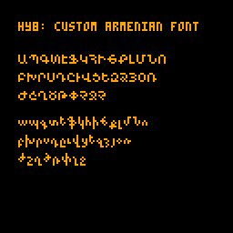
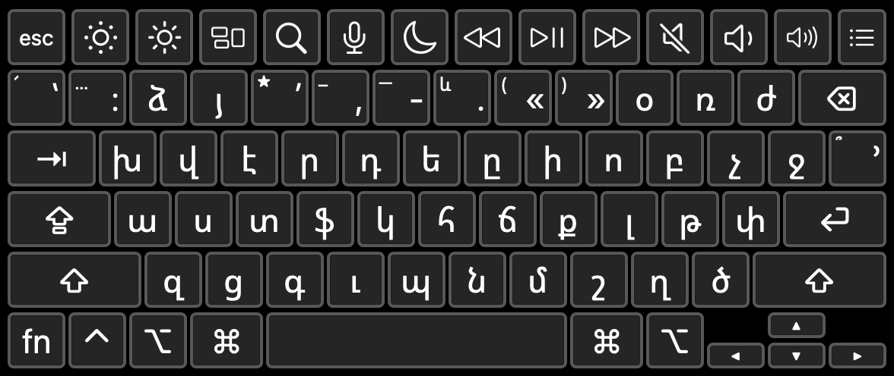

# hy8

An armenian font for [PICO8](https://www.lexaloffle.com/pico-8.php).

Original font [hypix](https://fonter.am/en/fonts/hypix) by Davit Saroyan.



## use

See [hy8_demo.p8](demo.p8)

## modify

See [hy8.p8](hy8.p8)

## layout
```lua
map = {
    ["a"] = "ա",
    ["b"] = "պ",
    ["c"] = "գ",
    ["d"] = "տ",
    ["e"] = "է",
    ["f"] = "ֆ",
    ["g"] = "կ",
    ["h"] = "հ",
    ["i"] = "ի",
    ["j"] = "ճ",
    ["k"] = "ք",
    ["l"] = "լ",
    ["m"] = "մ",
    ["n"] = "ն",
    ["o"] = "ո",
    ["p"] = "բ",
    ["q"] = "խ",
    ["r"] = "ր",
    ["s"] = "ս",
    ["t"] = "դ",
    ["u"] = "ը",
    ["v"] = "ւ",
    ["w"] = "վ",
    ["x"] = "ց",
    ["y"] = "ե",
    ["z"] = "զ",
    ["2"] = "ձ",
    ["3"] = "յ",
    ["0"] = "օ",
    ["-"] = "ռ",
    ["="] = "ժ",
    [","] = "շ",
    ["."] = "ղ",
    ["/"] = "ծ",
    [";"] = "թ",
    ["'"] = "փ",
    ["["] = "չ",
    ["]"] = "ջ",
}
```
